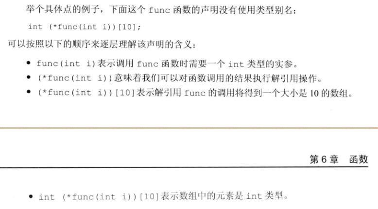

## 第二章  变量和基本类型

### 类型别名

传统的方法使用关键字**typedef**:

```C++
typedef double wages; // wages 是double的别名
typedef double *p; //p是double* 的同义词
```

别名声明语句: `using SI = Sales_item`，SI为Sales_item的同义词。或者使用`typedef Sales_item SI`

`decltype()`返回操作数或者表达式的类型，**并不会返回指向该类型的指针。**

### 顶层const

用名词**顶层const**来表示指针本身是一个常量，**底层const**表示指针所指的对象是一个常量。

## 第三章  字符串、向量和数组

### 迭代器

迭代器iter可以执行的操作有：  以及++和-- 


有如下的示例:


迭代器it可以在for循环中使用++运算符进行移动。访问对象的成员时，需要使用(*it).成员，C++将其简化为->运算符，可以直接使用->进行访问。在使用迭代器对容器进行操作时，不能向容器中添加元素。

左侧的迭代器减去右侧的迭代器，得到的是二者之间的距离，即为右侧迭代器向前移动多少个距离就能到达左侧的迭代器。其作差的结果的类型是名为difference_type的**带符号整数**，

### 数组

数组的下标是size_t类型的，并且数组的大小固定，无法动态变化。数组的下标可以是负数，p[a]翻译为*(p+a)，p为指针，a 可以是负数。

可以使用数组初始化vector对象，语法为: `vector<T> array(begin(arr), end(arr))`，必须使用一个头指针和尾后指针来初始化vector，并且新数组array中不包含尾后指针指向的元素，因此可以使用arr的一部分来初始化array。	**应当尽量使用内置类型，避免使用数组**。

**使用`()`进行构造函数的初始化，使用`{}`进行列表初始化。**如果无法使用列表初始化，编辑器会直接使用默认初始化。如：

```C++
vector<string> v{10, "hello"}; // 非列表初始化，v被初始化为10个"hello"
```


### 多维数组

C++中的多维数组是数组的数组，例如`int ia[3][4]`表示一个长度为3的数组，每一个元素都是一个长度为4的数组。第一个维度为行，第二个维度为列。初始化多维数组时，可以使用{ }进行初始化，如果{ }没有使用{ }进行 行元素的区分，会按照行依次填充，填充满则进入下一行；也可以只初始化每一行的前几个元素。

对多维数组进行for循环处理时，除了最内层的循环，其他循环的“取每一个元素”都应该声明为引用类型。因为C++对**数组名会自动初始化为指向首元素的指针（是指针，不是元素）**，在下一个循环里遍历这个指针而不是遍历这个指针指向的数组。*指针名和数组名等价（如果指针指向了这个数组），例如:

```c++
for(const auto &row : ia)  //如果不加引用，那么下面一个循环col遍历的是一个指针。 
    for (auto col : row)   
        cout << col << endl;
```

因为此种`for` 循环默认拷贝复制，即直接复制数组内的元素的值。因此如果想要使用这种方法修改数组元素，同样需要使用引用类型进行传递`auto &col : row`

## 第四章 表达式

左值与右值： 当一个对象被用作右值时，使用的是对象的值(内容)；而当一个对象被用作左值时，使用的是对象的身份(在内存中的位置，可以用来修改对象的内容)。

`*pbeg++`等价于`*(pbeg++)`。

### 位操作符

C++中的位操作符如下: 一般位操作符使用于无符号整型。


左移右移运算符的expr2为移动的位数（十进制数），左移在右侧插入0，右移视运算对象而定，如果对象是无符号整型，则在左侧插入0，如果是带符号整型，则在左侧插入符号位的副本或者值为0的二进制位。移位运算符又叫做IO运算符，满足左结合律，优先级比算数运算符低，但是比关系运算符、赋值运算符和条件运算符的优先级高。

### `sizeof`运算符

`sizeof`运算符返回一条表达式或者一个类型的名字所占用的字节数，满足右结合律。可以使用`sizeof`求数组大小，然后除以每个元素的大小从而得到数组的长度。

### 算数转换

整形提升指将小整数类型转化为大整数类型，例如将`int`类型提升为`unsigned int`类型；此外还有隐式的类型转换，例如变量可以转化为指针或者引用的常量定义，而指向常量的指针或者常量的引用不能用来转化为变量。

```c++
int i;
const int &j = i; //非常量转化为const int 的引用
const int *p = &i; //非常量的地址转化为const 的地址
int &r = j, *q = p; //错误：不允许const转化为非常量
```

显式转换：强制类型转换，格式为`cast-name <type>(expression)`，type是目标类型，expression是要转化的值，cast-name可以选择为static_cast  dynamic_cast  const_cast  reinterpret_cast 中的一种；区别详见p145

可以使用`const_cast`改变运算对象的底层`const`

```C++
const char *pc;
char *p = const_cast<char*>(pc); //将指向的底层const对象转化为非常量
```

注意，直接定义`const int i = 1`中的`const`是顶层的。

运算符优先表 p147

## 第五章  语句

语句作用域，使用{ }括起来的部分是变量的作用域，在作用域之外无法访问。悬垂else会自动和最近的、未匹配的if来进行匹配，和缩进无关。

```C++
switch (ch){
    case 'a':
        ++aCnt;
        break;
    case 'b':
        ++bCnt;
        break;
    defalut:
        ++i;
        
}
```

switch语句在遇到一个满足条件的case之后，会从这个标签开始，执行之后的所有case标签下的语句。

### try语句和异常处理

throw表达式：

```C++
if (item1.isbn() != item2.isbn())
    throw runtime_error('Data is different!')
cout<< item1+item2<< endl;
```

在上述表达式中，如果item1和item2调用函数`isbn()`不同，则会抛出一个异常，该异常是类型`runtime_error`的对象。抛出异常会终止当前的函数，并将控制权转移给处理该异常的代码。

try语句块： 其用法为：

```C++
try{
    program-statements
} catch (exception-declaration){
    handler-statements
} catch() ... ...
```

可以结合`throw`语句抛出的异常，利用`catch`语句进行异常的捕获，例如如下的例子：

```C++
while (cin>> item1 >> item2){
    try {
        //执行添加两个Sales_item对象的代码
        //如果添加失败，代码抛出一个runtime_error异常
    } catch (runtime_error err){
        //提醒用户两个ISBN必须一致，询问是否重新输入
        cout<< err.what()
            << "\nTry Again? Enter y or n" << endl;
        char c;
        cin>>c;
        if (!cin || c == 'n') // cin 读取一个字符，如果读入的是一个字符，那么cin>>为true; 否则为false。
            break; // 输入的非字符或者c = n时，跳出循环；
    }
}
```

当catch语句被完成之后，程序跳转到最后一个catch子句后的第一条语句执行。

当一个异常被抛出后，首先搜索抛出该异常的函数。如果没有找到匹配的catch子句，那么终止该函数，并在调用该函数的函数中继续寻找，如果仍旧没有找到，这个函数被终止，然后搜索调用该函数的函数，以此类推，直到找到匹配的catch语句。如果最终没能找到，那么程序会自动调用`terminate`的标准库函数进行程序的终止。

C++标准库中定义了一组异常类，定义在4个头文件中，例如在`stdexcept`头文件中定义的类：


对于`exception、 bad_alloc、bad_cast`的对象，只能使用其类内的构造函数初始化，即默认初始化（定义时不进行初始化），其他类型的异常必须提供初始值（通常是一个string或者字符串）进行初始化，不允许使用默认初始化，例如抛出一个`runtime_out`类型的异常时，使用字符串`"Data is different !"`进行了类的初始化。

## 第六章  函数

函数三要素：返回类型、函数名、形参类型。

声明函数名字时，之后必须跟形参列表的圆括号`(...)`，或者说圆括号形参`(...)`是函数名字的一部分，指针定义：`*func()`而非`(*func)()`.

局部静态对象：在程序执行路径第一次经过对象定义时初始化，直到程序终止才会销毁这个对象；这个对象不会重复的初始化定义，而是伴随着程序一直存在。定义方法为`static`关键字。

```C++
size_t count_calls(){
    static size_t ctr = 0;
    return ++ctr;
}
int main(){
    for (size_t i = 0; i!=10; ++i)
        cout << count_calls() << endl; //程序会记录调用count_calls()的次数，依次输出0~10.
}
```

函数在使用之前必须进行定义或者声明。函数的声明通常在头文件中，函数定义在源文件中。源文件应该包含 含有函数声明的头文件。

传值参数：当初始化一个非引用类型的变量时，初始值被拷贝给变量。因此对于**指针形参**而言，执行指针拷贝操作时，拷贝的是指针的值，在函数内部改变这个形参并不会影响原有的实参指针，也就是说函数外和函数内是两个指针，只不过他们的内容相同，指向了同一个对象，因此可以在函数内部修改这个对象。**在C++中，通常使用引用类型代替指针类型来访问函数外部的对象**。使用引用可以避免拷贝较大的对象，从而节省时间。传递进入额外的形式参数（引用），可以返回额外的信息。

函数在传递参数时，实参变量形参(引用)常量可以传递，但是实参标量形参(引用)变量会产生错误，即在修改常量。

当形参是`const`时，需要注意是顶层还是底层。使用实参初始化顶层`const`的形参时，其**顶层`const`**将会被忽略，此时传递一个常量或者变量对象均可：

```C++
void fcn(const int i){...} // 调用fcn时，既可以传入int又可以传入const int
```


### 数组形参

数组的性质是 不允许拷贝、以及作为数组直接使用=进行赋值。在使用数组时，数组名字会自动转化为一个指针。数组作为形式参数时，形参的类型均视作指向首元素的指针类型，例如下面的三种定义等价：

```C++
void print(const int*);
void print(const int[]);
void print(const int[10]); // 10是期望维度，实际传递进来的长度可以不是10；
int i = 0, j[2] = {0, 1};
print(&i); // 合理，&i的类型是int*
print(j);  // 数组名被解释为一个指针。
```

传递数组时可以额外传递一个表示数组长度的参数，以防访问越界。

此外，数组形参可以定义为引用类型，如:

```C++
void print(int (&arr)[10] ){
    for (auto elem : arr){
        cout<< elem << endl;
    }
}
int i = 0, j[2] = {0,1};
int k[10] = {0,1,2,3,4,5,6,7,8,9};
print(&i); print(j); //非法，实参不是int [10]类型
print(k); //合法
```

### 多维数组

多维数组在传递进入函数内部时，实际上和一维数组相同，只不过数组元素是指向数组的指针而已。所以可以直接使用一维数组的指针形参定义，来传递多维数组：

```C++
void print(int (*matrix)[10], int rowSize) { /* */}
void print(int matrix[][10], int rowSize)//等价定义，不过编译器会自动忽略第一个维度，因此可以省略不写数字；但是数组的第二维是数组类型的一部分，不能省略。
```

`print`函数接收一个数组指针matrix，该数组指针指向含有10个`int`元素的数组。因此可以将一个`int [][10]`类型的二维数组名字`name`传递进`print`中，例如`print(&name, name的行数)`。如果函数定义没有使用引用或者指针，那么C++会默认拷贝复制，不改变函数外部的变量值。

多维数组引用传递：

```C++
void print(int (&mat)[3][4]){}； //使用引用传递时，将所有数组视作一个整体进行引用传递，并且两个维度都必须进行指定。
int main(){
    int matrixA[3][4] = { {0,1,2,3}, {4,5,6,7}, {8,9,10,11} };
    print(A);
    return 0;
}
```

   如果形式参数的类型一致，但是个数未知，可以使用`initializer_list`形参进行参数传递，结合迭代器进行处理：

```C++
void error_msg(initializer_list<string> il){ //本质是类模板，和vector类似
    for(auto beg = il.begin(); beg != il.end(); ++beg){
        cout<<*beg<<" ";
    }
    cout<< endl;
}
```

### 返回值

函数返回一个值的方式和初始化一个变量或者形参的方式相同：返回的值用于初始化调用点的一个临时量，该临时量就是函数调用的结果。非引用和指针返回，函数会直接返回对象的拷贝。如果函数返回的类型是一个引用，则会返回这个对象的引用，并不会拷贝；注意，**不能返回局部对象的引用或者指针！**。函数在完成之后，它所占用的空间都会被随之释放掉（可以使用静态变量定义，避免这个变量被析构或者重复初始化定义），**引用或指针返回的值必须在函数结束后仍旧为一个左值，其余的返回类型都是一个右值，return的值将作为初始值来初始化这个类型的对象。**

```C++
char &get_val(string &str, string::size_type ix){
    return str[ix]; // 默认ix不会越界
}
int main(){
    string s("a value");
    cout << s << endl;
    get_val(s, 0) = 'A'; // 可以修改函数的引用返回值
    cout << s << endl; 
}
```

视返回值的类型，可以使用相应的初始化方式进行返回（详见之前的 **数组、vector等类型的初始化方式**），如 :

```c++
vector<string> 	process(){
    ...
    if (expected.empty())
        return {} ;//使用空列表初始化这个vector对象
    else if (expected == actual)
        return {"functionX", "Okay"};
    else
        return {"functionX", expected, actual}; // 返回列表初始化的对象
}
```

`main`函数无法调用自己。

### 返回数组指针

数组不能作为 = 拷贝的右值，或者数组不能作为初始化的右值，所以函数不能返回数组。因为数组名被解释为指向第一个元素的指针，但是函数可以返回数组的指针或者引用，

**方法1：类型别名**

```C++
typedef int arrT[10]; // arrT是一个类型别名，它表示的类型是含有10个整数的数组
using arrT = int[10]; // 等价的类型别名定义
arrT* func(int i); // func 返回一个arrT的指针，指向一个10个整数的数组。
```

**方法2：返回指针**

返回一个数组指针，则必须包含数组的长度，语法为： 

```C++
Type (*function(parameter_list))[dimension];
```

例子：



除此以外，可以使用 **尾置返回类型**，其在形参列表之后使用`->`开头，并且函数的类型可以直接使用`auto`。例如：

```C++
auto func(int i) -> int (*) [10];
```

函数`func`返回类型为`int (*)[10]`，是一个指向含有10个整数的数组的指针。

如果已知函数返回的数组类型（函数返回的指针将指向哪一个同类型的数组），可以使用`decltype`关键字来完成和类型别名相同的任务：

```C++
int odd[] = {1, 3, 5, 7, 9};
int even[] = {0, 2, 4, 6, 8};
decltype(odd) *arrPtr(int i){
    return (i % 2) ? &odd : &even; //返回一个指向数组的指针（数组名字只是指向了第一个元素，引用此名字则指向整个数组）
}
```

注意`decltype`之后有代表指针定义的`*`

## 函数重载

如果在同一个作用域内，一个函数的名字被重复定义，称之为重载；例如：

```C++
void print(const char* cp);
void print(const int* beg, const int* end);
void print(const int ia[], size_t size);
```

调用这些函数时，编译器会根据传递的实参来对应选择重载函数。**main函数不能重载。**注意声明函数的形参名字可以省略不写，只标明类型即可。而使用`顶层const`定义的函数，顶层const会被忽略：

```C++
void fcn(const int i);
void fcn(int i); // 错误，重复定义了fcn(int i)
Record lookup(Phone*);
Record lookup(Phone* const); // 错误，重复声明了 Record lookup(Phone*), const是顶层const

Record lookup(Account*);
Record lookup(const Account*); // 新函数，作用于指向常量的指针；此时的const是底层const（即指针所指向的对象是一个常量）
```

因此，**形参也被当作函数名字的一部分**。

如果在局部作用域内声明 重载函数，那么会自动隐藏外部作用域中声明的函数，在不同的作用域中无法重载函数名。

```C++
void print(const string &);
void print(double);
void fooBar(int ival){
    void print(int); // 局部作用域中重载print
    print(3.14); // 会调用print(int), print(double)被自动隐藏。
    print("Hello!") // 报错
}
```

**在C++中，名字查找先于类型检查。**因此，编译器先会寻找对该函数名的声明，找到的是局部声明的`void print(int)`；而调用打印字符串的`print()`会报错，因为 `void print(const string &)`被隐藏了。

### 默认实参

一旦某一个形参被赋予默认值，那么它后面的所有形参都必须有默认实参。

### 内联函数

内联函数即为在每个调用点“内敛地”展开，例如定义如下的函数并调用：

```C++
inline const string& shorterString(const string &s1, const string &s2){
    return s1.size() <= s2.size() ? s1: s2;
}
int main(){
    string s1("ab");
    string s2("cde");
    cout << shorterString(s1, s2) << endl; // 将会展开为 cout << (s1.size() <= s2.size() ? s1: s2;) << endl;
    return 0;
}
```

内联函数用于优化规模较小的函数，使用前缀关键字`inline`来定义。

`constexpr`

**assert预处理宏**

assert是一种预处理宏(preprocessor marco)。使用方法为:

```C++
assert (expr);
```

首先对expr求值，如果表达式为假(即为0)，则assert输出信息并终止程序的执行。如果表达式为真(即非0)，则assert什么都不做。

**NDEBUG**

使用`#define NDBUG`可以跳过所有的assert检查。默认状态下没有定义NDEBUG，意义为“关闭调试状态”。

### 函数匹配

针对重载函数，函数匹配的第一步是选定本次调用对应的重载函数集，集合中的函数称为候选函数；候选函数的特征为：与被调用的函数重名，且函数声明在函数调用点可见。第二步考察本次调用的实际参数，此时筛选出的函数称作可行函数：一是形参数量和本次调用的实参数量相等，二是每个实参的类型和对应的形参类型相同，或者可以转换为形参的类型。然后进一步会寻找最佳匹配：实参类型和形参类型越接近越好。如果最后筛选的函数多于一个，那么编译器会因为二义性请求而拒绝调用。

**调用重载函数时应尽量避免强制类型转换。**

实参类型转换 p219

### 函数指针

函数指针指向的是函数并非对象，指向某种特定类型。函数的类型为 去掉函数名之后的关键词，由返回类型和形参列表所组成。例如:

```C++
bool lengthCompare(const string &, const string &);
// 函数lengthCompare的类型是bool (const string &, const string &)
```

定义一个同类型的指针，指向该函数：

```C++
bool (*pf)(const string &, const string &); // 未进行初始化
pf = lengthCompare; // 将p指向函数lengthCompare
pf = &lengthCompare; // 等价定义，取地址符可选
pf("abc", "cde");
(*pf)("abc", "cde"); //等价调用lengthCompare
pf = 0; //指针置空，不指向任何函数
```

```C++
bool (*pf)(const string &, const string &) = lengthCompare; //直接初始化定义
```

指针的类型必须和指向的函数类型相同。重载函数的指针定义时，必须和某一个重载函数类型相同。

#### 函数指针形参

函数的形参可以定义为指向某个函数的指针：

```C++
void useBigger(int a, int b, bool (*pf)(const string &, const string &) );
void useBigger(int a, int b, bool pf(const string &, const string &) ); //等价定义
//使用类型别名简化
typedef bool Func(const string &, const string &); //定义了一个新的函数类型别名
typedef decltype(lengthCompare) Func2; //上述定义的等价定义

typedef decltype(lengthCompare) *FuncP2; //定义了一个函数指针别名
typedef bool (*FuncP1)(const string &, const string &); //上述定义的等价定义

void useBigger(int a, int b, Func);  //编译器自动将定义的Func类型转化为指针
void useBigger(int a, int b, FuncP2); //等价声明
```

#### 返回指向函数指针

使用类型别名简化：

```C++
using F = int(int, int*); //定义函数类型的别名F，F是函数类型
using PF = int(*)(int, int*); // PF是函数指针
F f1(int); // 错误，f1不能返回一个函数
PF f1(int); // 正确，f1可以返回一个函数指针
```

## 第七章  类

在类的内部声明成员函数，在类的外部定义成员函数。定义前需要加关键字 `类名称::`来说明名字空间。通常类声明和类定义在不同文件中。成员函数通常在类内声明，在类外定义。

public: 在此作用域内的函数和成员可以被程序访问。

private: 在此作用域内的函数和成员只能被类内的成员函数访问，不能在程序外访问。即实现了 “隐藏封装”。

### 构造函数

构造函数的名字和类的名字相同，并且禁止指定返回值和返回值类型。构造函数可以进行重载，较短的构造函数可以在类内直接定义。

### 友元

在类定义的开头，在前面加关键字`friend`来声明友元函数，友元函数可以访问私有成员和私有成员函数。

